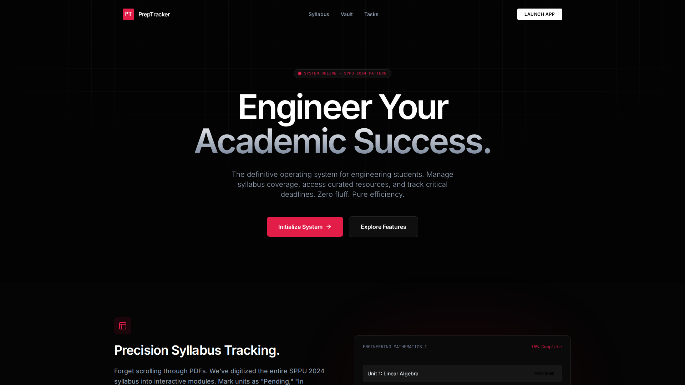

# PrepTracker


> An academic dashboard for syllabus progress, study resources, and tasks.

---

## 🚀 Live Demo

**[Launch PrepTracker](https://manav4u.github.io/PrepTracker/)**

---



## 📖 Overview

**PrepTracker** is an academic dashboard for the SPPU 2024 Pattern, with syllabus tracking, resource links, and tasks.

The interface uses a dark theme, subject views, and progress indicators.

### Why PrepTracker?

*   **Syllabus tracking:** Mark the included units as Pending, In Progress, or Mastered.
*   **Resource links:** Browse the included notes, videos, and reference materials.
*   **Browser storage:** Profile, progress, tasks, and custom resource links use `localStorage`. The site also loads Google Analytics and external fonts. Do not treat local storage as a no-tracking guarantee; clearing browser storage removes local data.
*   **Tasks:** Track study tasks with priorities and due dates.

## ✨ Key Features

### 1. **Smart Syllabus Tracking**
*   **Granular Control:** Track progress at the Unit level for every subject (Maths, Physics, Mechanics, etc.).
*   **Visual Analytics:** Real-time progress bars and completion percentages for each subject.
*   **Status Indicators:** Color-coded states (Pending, In Progress, Mastered) give you an instant health check of your preparation.

### 2. **Resource Vault**
*   **Categorized Library:** Filter resources by subject, type (PDF, Video, Book), and unit.
*   **Direct Links:** One-click access to Google Drive folders, YouTube playlists, and reference materials.
*   **Custom Additions:** Add your own personal study links to the vault (stored locally).

### 3. **Task Command Center**
*   **Priority Matrix:** Sort tasks by High, Medium, or Low priority.
*   **Context Aware:** Tag tasks with specific subjects or categories (Lab, Theory, Assignment).
*   **Persistent State:** Tasks remain saved even if you close the browser.

### 4. **Industrial Elite UI**
*   **Dark Mode Native:** A dark theme for the application interface.
*   **Responsive:** Responsive layouts for different screen sizes.
*   **Framer Motion:** UI animations provided by Framer Motion.

## 🛠️ Tech Stack

Dependency versions below match `package.json` at this documentation checkpoint.

*   **Frontend Framework:** [React 19](https://reactjs.org/) (`^19.2.3`)
*   **Language:** [TypeScript](https://www.typescriptlang.org/) for typed application code.
*   **Build Tool:** [Vite](https://vitejs.dev/) for development and production builds.
*   **Styling:** [Tailwind CSS](https://tailwindcss.com/) with a custom configuration for the "Industrial Elite" theme.
*   **Animations:** [Framer Motion](https://www.framer.com/motion/) for UI animations.
*   **Routing:** [React Router 7](https://reactrouter.com/) (`^7.11.0`) (HashRouter for GitHub Pages compatibility).
*   **Icons:** [Lucide React](https://lucide.dev/) for icons.
*   **State Management:** React Context API + Custom Hooks.
*   **Persistence:** `localStorage` API for client-side data retention.

## 🚀 Getting Started

Follow these instructions to get a local copy of the project up and running.

### Prerequisites

*   Node.js 20 (the version used by the deployment workflow)
*   npm or yarn

### Installation

1.  **Clone the repository:**
    ```bash
    git clone https://github.com/manav4u/PrepTracker.git
    cd PrepTracker
    ```

2.  **Install dependencies:**
    ```bash
    npm install
    ```

3.  **Start the development server:**
    ```bash
    npm run dev
    ```

4.  **Open in browser:**
    Navigate to `http://localhost:3000/PrepTracker/` (or the port shown in your terminal).

### Deployment

This project is configured for **GitHub Pages**.

1.  Build the project:
    ```bash
    npm run build
    ```
2.  The build artifacts will be in the `dist/` directory.
3.  The existing `.github/workflows/deploy.yml` workflow builds pushes to `main` with `npm ci` and publishes `dist/` to GitHub Pages. Vite uses `/PrepTracker/` as its base path.

## 📂 Project Structure

```
PrepTracker/
├── .github/workflows/deploy.yml
├── components/          # Reusable interface components
├── context/             # Application data and browser storage
├── pages/               # Dashboard, resources, tasks, and other views
├── public/              # Static assets
├── verification/        # Screenshot capture script and saved images
├── App.tsx              # Application routes and shell
├── index.tsx            # Entry point
├── index.html
├── index.css
├── constants.tsx        # Included syllabus and default data
├── types.ts
├── package.json
├── tailwind.config.js
└── vite.config.ts
```

## Verification limits

`package.json` provides `dev`, `build`, and `preview` scripts. It does not currently define a test script. The `verification/` directory contains screenshot evidence and a capture script, not an automated application test suite. This documentation update does not claim a full feature, accessibility, or performance audit.

## 🤝 Contributing

Contributions are welcome! If you have suggestions for new features, bug fixes, or resource additions:

1.  Fork the repository.
2.  Create a new branch (`git checkout -b feature/AmazingFeature`).
3.  Commit your changes (`git commit -m 'Add some AmazingFeature'`).
4.  Push to the branch (`git push origin feature/AmazingFeature`).
5.  Open a Pull Request.

## 📄 License

Distributed under the MIT License. See `LICENSE` for more information.

---

**Built with ❤️ for Engineers.**
